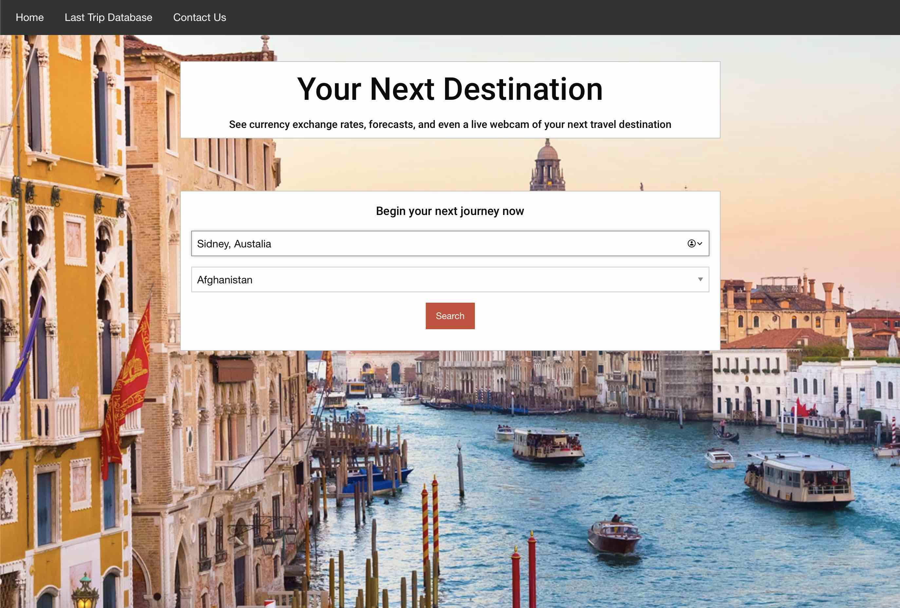
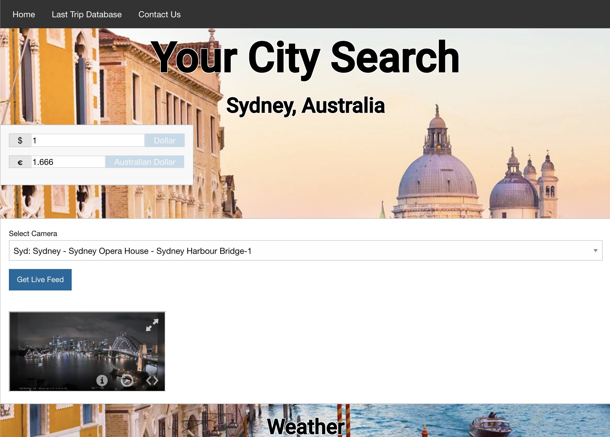
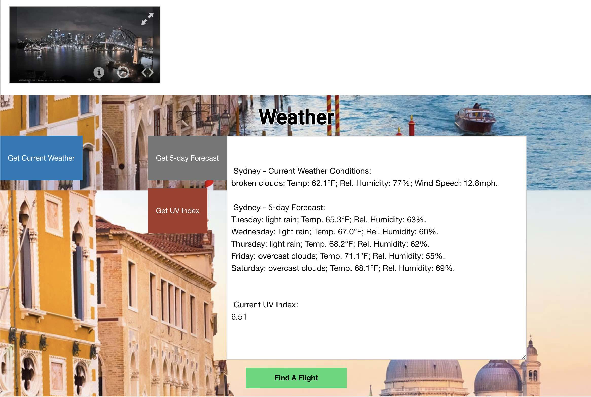
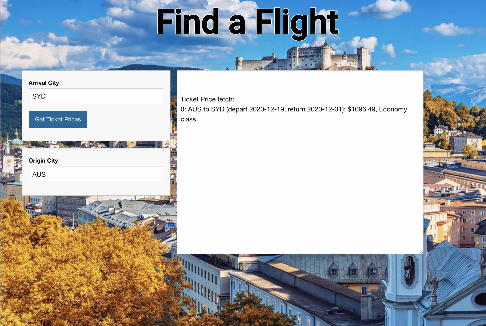

# LiveTravelInfo
> Live travel information for various countries.

As a team, we wanted to make an information dashboard that would help us to make travel plans when we went
out of the country. There were a lot of features we could include, but we decided the main points we wanted to hit 
for a viable product were a list of recent ticket prices so we'd know how much the fare was going to cost, 
details about the current weather so we'd know what to pack, currency conversion rates so we'd know how much 
our money was worth, and local camera feeds so we'd have an idea of what the city looked like. 

## User Story
AS A travel enthusiast
I WANT information about my destination city
SO THAT I can plan my trip effectively

GIVEN I have entered my destination
THEN I am taken to a new page that will display destination information
WHEN I view the currency conversion panel
THEN I am presented with the current currency conversion rate against the US Dollar
WHEN I view the weather section
THEN I see a 5-day forecast for the destination
WHEN I check out the webcam
THEN I see live images of cities near my destination
WHEN I note the time zone callout
THEN it lets me know which time zone my destination is in.
WHEN I leave the page and come back
THEN the page will remember my destination

## Usage
The main page is a simple search pane where you enter the city and country to which you're headed. We included a
comprehensive database of cities and countries and limited fuzzy matching capabilities, so it's okay if you don't know
exactly how your destination is spelled. Just type it in and click the 'Search' button.
On the search results page, you'll find the exchange rate against the dollar and a dropdown list of the available
webcams in the area. Select the webcam you'd like to see and click the 'Get Live Feed' button to bring the view up
in the iFrame below. At the bottom of the page is the weather info panel, where you can click the button to get the
current weather, a five-day forecast, or the current UV index. Click the 'Find a Flight' button at the bottom of the
page to see the ticket info page.
This page will search through recent ticket sales from the origin city to the arrival city and list what it finds,
including the price, class, and depature and arrival dates, if available. This should be enough to give you an idea
of how much your tickets are going to cost. The API query for this search can take a minute to return data, so don't
be concerned if it doesn't seem to do anything immediately after you press the button--it's working on your request!

## Screenshots

